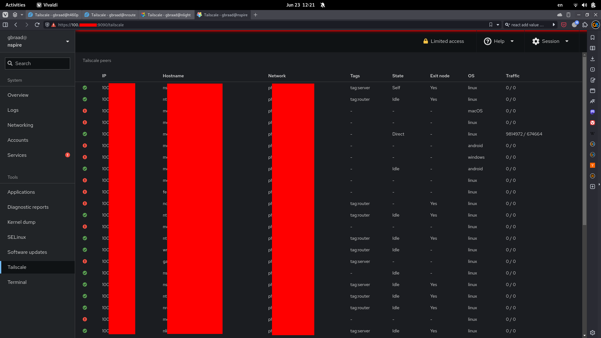

Cockpit application to manage Tailscale
=======================================


A Cockpit application to manage Tailscale with comprehensive packaging support for both RPM and Debian-based distributions.



## Features

- Web-based Tailscale management through Cockpit interface
- Complete Debian/Ubuntu packaging support (`.deb` packages)
- Existing RPM packaging for Fedora/RHEL/CentOS
- Comprehensive development environment support
- CI/CD integration with testing support

Development
-----------

This repository includes complete development environment support for the Cockpit Tailscale application.
The project supports multiple development workflows:


### Prerequisites

#### For RPM-based distributions (Fedora, RHEL, CentOS)

Install the following packages to develop and build:

```bash
$ sudo dnf install -y make npm
```

To build RPM packages, you need:

```bash
$ sudo dnf install -y rpm-build gettext libappstream-glib
```

#### For Debian/Ubuntu distributions

Install the required build dependencies:

```bash
$ sudo apt install -y debhelper devscripts build-essential nodejs npm make gettext
```


#### Cockpit User Setup

If you want to run Cockpit locally, you need a user with a password:

```bash
$ sudo dnf install -y passwd
$ sudo passwd $(whoami)
```

After which you can use this user to log in to Cockpit.


### Building

#### Development Build
```bash
$ npm run dev
```

#### Production Build
```bash
$ npm run build
```

#### Package Building

**For RPM packages:**
```bash
$ npm run rpm
```

**For Debian packages:**
```bash
$ make deb
```

The Debian packaging creates a complete `.deb` package with proper dependencies and metadata, suitable for installation on Debian and Ubuntu systems.


### Installation and Development

#### Local Installation
After building, copy the contents to one of these locations:
- `/usr/share/cockpit/tailscale` (system-wide)
- `/usr/share/local/cockpit/tailscale` (local system)
- `~/.local/share/cockpit/tailscale` (user-specific)

#### Development Environment Setup

For convenience during development, you can create a symlink:

```bash
$ npm run link    # Creates symlink in ~/.local/share/cockpit/tailscale
$ npm run unlink  # Removes the symlink
```

For system-wide development links (requires sudo):
```bash
$ npm run linkusr    # Creates symlink in /usr/local/share/cockpit/tailscale
$ npm run unlinkusr  # Removes the symlink
```

Note: You may need to log out and log back in for Cockpit to recognize changes, as it caches pages and assets.

#### Running Cockpit

You can run Cockpit in a container or development environment:

```bash
$ npm run cockpit
```

This requires an account with a password to log in.

#### Troubleshooting Origins

If login fails with `bad Origin` errors, modify `/etc/cockpit/cockpit.conf`:

```ini
[WebService]
Origins=https://your-development-server.domain
```


## Debian Packaging

This project now includes comprehensive Debian packaging support. The `debian/` directory contains all necessary files for building `.deb` packages:

- **debian/control** - Package metadata and dependencies
- **debian/rules** - Build rules and packaging instructions  
- **debian/changelog** - Package version history
- **debian/copyright** - License and copyright information
- **debian/README.md** - Detailed Debian packaging documentation

### Installing from Debian Package

1. Build the package: `make deb`
2. Install: `sudo dpkg -i cockpit-tailscale_*.deb`
3. Fix dependencies if needed: `sudo apt-get install -f`

The package installs files to:
- `/usr/share/cockpit/tailscale/` - Application files
- `/usr/share/metainfo/` - AppStream metadata
- `/usr/share/doc/cockpit-tailscale/` - Documentation

## CI/CD Support

The project includes CI/CD configuration:
- **Cirrus CI** configuration for automated testing
- Support for multiple distributions (Fedora, CentOS)
- Automated testing with Firefox browser
- Translation template generation

Authors
-------

| [](http://gbraad.nl "Gerard Braad <me@gbraad.nl>") |
|---|
| [@gbraad](https://gbraad.nl/social)  |
